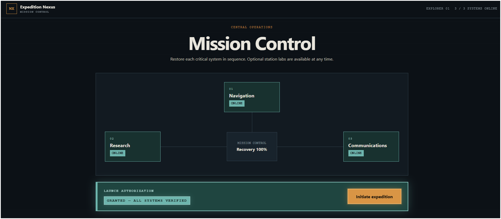

# Expedition Nexus

Expedition Nexus is an interactive front-end project built with HTML, CSS, and vanilla JavaScript. The experience is structured around a mission-control interface where the user restores three systems, authorizes an expedition, and can explore several optional side challenges.

[View Live Project](https://jessgray-dev.github.io/expedition-nexus/)



## Overview

The main mission follows a sequence of three systems:

- **Navigation** — choose a destination and vessel, analyze the route, and calibrate the navigation system.
- **Research** — reconstruct a terrain survey, review observation data, identify a target species, and complete a scanner sequence.
- **Communications** — use the recovered mission data to build and transmit a field report.

Each completed system changes the application state and unlocks the next stage. Once all three systems are online, Mission Control authorizes the launch sequence and generates a mission debrief.

Progress is saved in the browser with `localStorage`, so an unfinished session can be continued later or reset from Mission Control.

## Station Labs

Four optional labs can be completed independently of the main mission:

- **Engineering** — assemble a valid equipment loadout within a fixed budget, then use approved materials to fabricate an upgrade.
- **Tactical** — play a short card-based combat simulation with type advantages and persistent round state.
- **Temporal Research** — analyze environmental clues, estimate plausible dates, and resolve three archived signals.
- **Academy** — answer a science question retrieved from the Open Trivia Database, with a local fallback if the request is unavailable.

Completing the Engineering fabrication challenge also produces an upgrade that affects the Tactical simulation.

## Technical Notes

The project is written without a framework or build system. Application data is stored in JavaScript objects and rendered into the interface as the user progresses.

Some of the features used throughout the project include:

- DOM creation and updates
- event-driven UI state
- form handling and validation
- arrays, objects, filtering, and calculations
- conditional unlocking and progression
- browser `localStorage`
- dynamic form fields and generated report text
- asynchronous API requests with fallback data
- small game and puzzle state systems
- responsive layouts and CSS transitions
- reduced-motion support
- inline status and validation feedback

## Project Structure

```text
expedition-nexus/
├── index.html
├── styles.css
├── script.js
├── README.md
├── ATTRIBUTIONS.md
└── assets/
    └── images/
        └── expedition-nexus-preview.png
